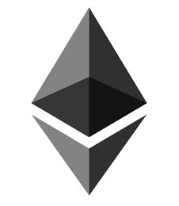

partnr
=======
An dApp for saving together using CDPs in [Dai](https://makerdao.com/en/dai/) for stability. Currently only ethereum but eventually[ multi-collateral dai](https://makerdao.com/da/whitepaper/#mkr-and-multi-collateral-dai).




<!-- ABOUT THE PROJECT -->

### Built With
* [React Native](https://facebook.github.io/react-native/)
* [Truffle](https://github.com/trufflesuite/truffle)
* [Drizzle](https://www.trufflesuite.com/drizzle)


<!-- GETTING STARTED -->
## Getting Started
### Prerequisites

This is an example of how to list things you need to use the software and how to install them.
* [yarn](https://yarnpkg.com/lang/en/docs/install/#mac-stable)
```sh
brew install yarn
```

### Installation

1. Clone the repo
```sh
git clone https:://github.com/your_username_/Project-Name.git
```
2. Install NPM packages
```sh
yarn
```


<!-- CONTRIBUTING -->
## Contributing

Contributions are what make the open source community such an amazing place to be learn, inspire, and create. Any contributions you make are **greatly appreciated**.

1. Fork the Project
2. Create your Feature Branch (`git checkout -b feature/AmazingFeature`)
3. Commit your Changes (`git commit -m 'Add some AmazingFeature`)
4. Push to the Branch (`git push origin feature/AmazingFeature`)
5. Open a Pull Request


<!-- LICENSE -->
## License

Distributed under the MIT License. See `LICENSE` for more information.

